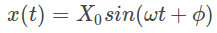
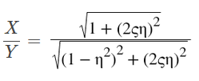

When an applied force causes the system to vibrate it is considered as a case of forced vibration. An external excitation is often reduced to one of the following types:

<li>External Harmonic Force

</li>
<li>Base Excitation

where is the motion of the base</li>

<li>Rotating Imbalance

 where m0 is the imbalance mass e is the eccentricity of imbalance mass and ω is the angular velocity(rad/s) of rotation

</li>

**Solution of the System**

The solution of the forced vibration system consists of a steady state part and a transient part. The steady state response is independent of the initial conditions. The transient part comes to zero with time and is usually neglected. The steady state response is of the form

where X0 is the amplitude and φ is the phase of steady state vibration. For  base excitation the steady state amplitude is given by

where η = ω/ωn is the ratio of operating frequency to the natural frequency of the system.

